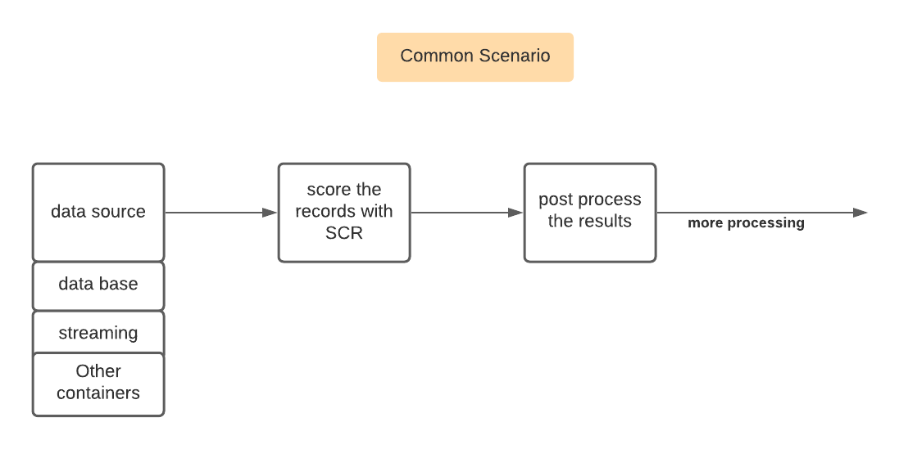
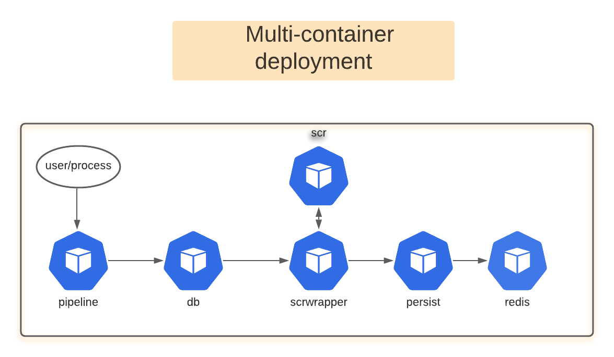

# pipeline-simple -- A composition of containers including SCR


## Install and setup

Please see [setup notes](dev.md) to setup the demo on your laptop. There also instructions there on running the demo on a cloud provider. Azure is used as an example.

## Introduction

The repository explores a very common use case of SCR.

1. Read data from a persisted source(ex: csv files)
2. Score each of the records(scenarios) using a SCR container
3. Forward the results to some other container for further processing or persistence.



## Approach

A multi-container deployment is used to create the pipeline shown in the figure above. The deployment uses the following containers to create the pipeline shown below.

- **pipeline** - Service acting as an entry point to process run time input from user and pass it on to the db service

- **db** - this service reads a specified csv file and sends the data to scrwrapper service - it sends the records to scrwrapper and sends the next one without waiting on a response. For other data sources modify this service to read from the new source.

- **scrwrapper** - Takes the input from the db service, scores it using scr service and sends the output to persist service. The scr container is specified in the SCR_URL environment variable

- **scr** - scr running as a service to score the data

- **persist** - Takes the input sends it to redis for persistence

- **redis** - The redis database service for persisting the results.



## Basic Design - Multi Container Deployment

All flows controlled via environment variables.

A service can call other services using the service name as the host.

An example:

In this POC there are services named db and scrwrapper. So the code in the db service can access service in scrwrapper using code as follows. The target url(in this case it is scrwrapper/scrwrapper) is specified in the environment variable.

```js
let config = {
    url: 'http://scrwrapper/scrwrapper',
    method: 'POST',
    data: data
};

let r = await axios(config);
... do something...

```

## Batch mode

Unlike in MAS, the SCR can be used to score in batch.
A sample code to execute pipeline is shown in scripts/pipeline.js
In fact this code is very similar to what is in the index.html.

One must pay special attention to the container feeding the scrwrapper. Ideally there will be multiple feeders working in parallel to feed that data to scrwrapper. This along with replication of the services would give one the best option to process data in batch.

## Thinking out loud

The patten in this POC can be used for creating a variety of piplines. Here are  a few examples:

- **db service**  Change it to read from a database, take a feed from Kafka, ESP or othe streaming services.

- **redis** Change it to some cloud storage, pass the url to service that calls Viya to do analysis of the output data

- Add other services - both SAS and non-SAS containers

## What-if OR Ravings of a Mad Man

What if we could create a whole set of SAS containers that could be linked with non-SAS containers to create interesting pipelines. These can take advantage of the scalability and high availability of the cloud.


